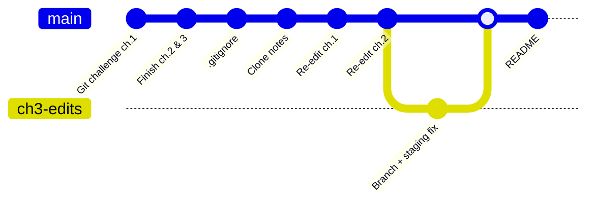

# Git & GitHub (section 27)

Command-line **Git** and **GitHub** practice from **Dr. Angela Yu’s** *[The Complete Full-Stack Web Development Bootcamp](https://www.udemy.com/course/the-complete-web-development-bootcamp/)* (**Section 27** · lessons **216–223**). There’s no app to open here, just scratch text files I edited while working through commits, branches, merges, and the rest. The point of this folder is the **commit history** itself; that’s what the exercises were building toward.

**Contents:** [What's learned](#whats-learned) · [Course map](#course-map) · [How I practiced](#how-i-practiced) · [Navigate this repo](#navigate-this-repo)

---

## What's learned

| Area | Topics |
| --- | --- |
| **Git basics** | `git init`, status, add, commit, log, diff |
| **`.gitignore`** | Keeping junk (`.DS_Store`) and secrets out of the repo |
| **Remotes & GitHub** | Remote repos, push/pull, cloning |
| **Branching** | Branches, checkout, merge, resolving simple conflicts |
| **Collaboration** | Forking, pull requests (course walkthrough) |

---

## Course map

| Lesson # | Focus | In this folder |
| --- | --- | --- |
| 216–217 | Git on the command line | Commits on [`chapter*.txt`](./chapter1.txt) |
| 218 | GitHub & remotes | Push/pull of this bootcamp repo (lesson exercise) |
| 219 | `.gitignore` | [`.gitignore`](./.gitignore), untracked [`secrets.txt`](./secrets.txt) |
| 220 | Cloning | [`clone_notes.txt`](./clone_notes.txt) |
| 221 | Branching & merging | Edits across `chapter*.txt` — see commit tree below |
| 222 | Optional Git challenge | [`chapter1.txt`](./chapter1.txt), [`chapter2.txt`](./chapter2.txt), [`chapter3.txt`](./chapter3.txt) — *Tale of Two Cities* snippets |
| 223 | Forking & pull requests | Course demo only, nothing saved here |

---

## How I practiced

Commits that touched `Git/`. Oldest on the left, newest on the right. Chapter 3 edits were done on a separate branch and merged back (lesson 221); everything else landed on `main`.

Run `git log --oneline --graph -- Git/` from the repo root to inspect the history locally.

---

## Navigate this repo

**← Previous:** [React (section 36)](../React/)  
**→ Next:** [Bootcamp overview (root README)](../README.md) — *Node, Bash, and back-end sections still ahead in the course.*

---
