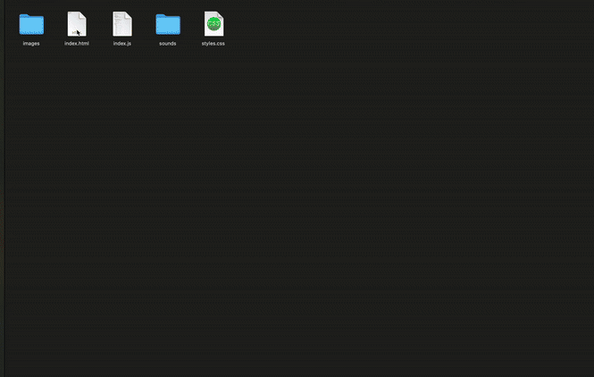

# 📟 JavaScript Projects

This folder contains my JavaScript practice from Dr. Angela Yu’s Web Development Bootcamp. It includes foundational syntax exercises, logic challenges, DOM manipulation, and two interactive browser games.

Each file or project aligns with a specific lesson or challenge in the course and reflects hands-on implementation of key JavaScript concepts.

---

## 🧠 Skills Practiced

- JavaScript syntax and variables (ES6)
- String and number operations
- Conditionals and loops
- Functions and parameters
- Arrays and objects
- DOM manipulation
- Event listeners and user interaction
- Higher-order functions and callbacks
- Keyboard and mouse event handling
- HTML/CSS integration with JS

---

## 📁 Folder & File Overview

### 🔢 Core JS Practice Files

| File | Concept |
|------|---------|
| `Variable.js`, `DataType.js`, `Name.js` | Variable declarations, types, and naming |
| `TextCasing.js`, `Tweet.js`, `TweetSplice.js` | String manipulation and slicing |
| `Calculator.js`, `MilkBudget.js` | Math and arithmetic |
| `Fizzbuzz.js`, `99Bottles.js` | Loops and control flow |
| `GuestList.js`, `Alert.js` | Arrays and alert behavior |
| `DogtoHumanAge.js` | Function-based calculations |
| `Fibonacci.js`, `BeepDiagonal.js` | Recursion and nested loops |
| `Karel.js`, `KarelChessBoard.js` | Logic puzzles and challenges |
| `Objects.js` | Objects and dot notation |

---

### 🧩 Interactive Projects

| Folder | Description |
|--------|-------------|
| `DOM Challenge Starting Files` | Practice selecting and modifying DOM elements |
| `Dicee+Challenge++Starting+Files` | Two-player dice game using images, random numbers, and conditionals |
| `Drum Kit Starting Files` | Keyboard-driven virtual drum set using event listeners and audio playback |

---

### 🎲 Dicee Challenge Preview

A two-player dice game built using JavaScript conditionals, image manipulation, and DOM updates.
To play the game, refresh the page! The page should display the person with the larger dice value as the winner.

---

### 🥁 Drum Kit Preview

A virtual drum set using keyboard events to play sounds and trigger button animations.
Press the keys or the display directly to make different drum sounds. Volume up!

---

### 🧪 DOM Challenge Preview

Practiced selecting elements, manipulating styles, and updating HTML content dynamically through Javascript.

---

## 📌 Course Mapping

This folder covers material from:

- **Section 14:** Intro to JavaScript ES6 (Variables, Strings, Math)
- **Section 15:** Intermediate JavaScript (Control flow, Loops, Arrays)
- **Section 16:** DOM Manipulation Basics (selecting, styling, attributes)
- **Section 17:** Boss Level 1 — Dice Game
- **Section 18:** Advanced JS & DOM — Drum Kit App

---

## 🚀 Running the Projects

1. Open the folder of the project you're interested in.
2. Open `index.html` (or html file in the folder) in your browser.
3. View and edit `index.js` for the main JavaScript logic.
4. Use the browser dev tools to interact and debug.

> For standalone JS files (like `Fizzbuzz.js`, `Objects.js`, etc.), paste into the browser console or wrap in a basic HTML runner.

---

## 🎯 Purpose

These projects show my journey through vanilla JavaScript. From core language syntax to interactive web apps, this folder demonstrates my growth and capability in frontend scripting.

---

## 🙌 Let’s Connect

If you’d like to collaborate or review my work, feel free to connect via GitHub or [LinkedIn](https://www.linkedin.com/davidhu426).
