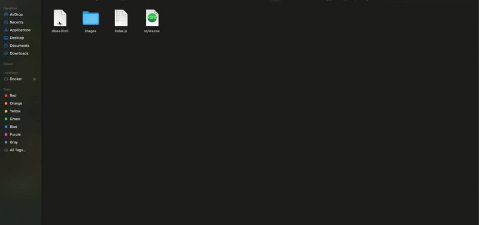

# JavaScript (sections 14–18)

Vanilla **JavaScript (ES6+)** drills and small browser apps from **Dr. Angela Yu’s** *[The Complete Full-Stack Web Development Bootcamp](https://www.udemy.com/course/the-complete-web-development-bootcamp/)*. Root-level `*.js` files are **language-only** exercises; subfolders are **DOM + events** projects you open in a browser. Broader context: [repo overview](../README.md).

**Contents:** [Competencies](#competencies) · [Course map](#course-map) · [Root scripts (14–15)](#root-scripts-1415) · [Browser projects (16–18)](#browser-projects-1618) · [Previews](#previews) · [Run locally](#run-locally) · [Related](#related)

---

## Competencies

| Area | What’s in here |
|------|----------------|
| **Language core** | Types, variables, strings, math, control flow, functions |
| **Collections & logic** | Arrays, objects, loops, small algorithms (e.g. FizzBuzz, Fibonacci) |
| **DOM** | Querying elements, changing content/styles/attributes |
| **Events & UX** | Click and **keyboard** listeners, animations, conditional UI updates |
| **Media** | Image swaps (dice), **HTML audio** playback (drum kit) |

---

## Course map

**`#`** is the **Udemy section number** (same convention as the [root course map](../README.md#course-map)).

| # | Focus | Where it lives |
|---|--------|----------------|
| **14–15** | ES6 syntax → control flow, arrays/objects, callbacks-style practice | Root [`*.js`](#root-scripts-1415) |
| **16** | DOM manipulation challenge | [`DOM Challenge Starting Files`](./DOM%20Challenge%20Starting%20Files/) |
| **17** | Dice game (random rolls, DOM + images, win logic) | [`Dicee+Challenge+-+Starting+Files`](./Dicee+Challenge+-+Starting+Files/) |
| **18** | Drum kit (keyboard events, sounds, classes) | [`Drum Kit Starting Files`](./Drum%20Kit%20Starting%20Files/) |

---

## Root scripts (14–15)

Run with Node, drop into a scratch HTML page, or use the console.

| Files | Topics |
|--------|--------|
| `Variable.js`, `DataType.js`, `Name.js` | Declarations, types, naming |
| `TextCasing.js`, `Tweet.js`, `TweetSplice.js` | Strings, slicing |
| `Calculator.js`, `MilkBudget.js` | Arithmetic, simple programs |
| `Fizzbuzz.js`, `99Bottles.js` | Loops, branching |
| `GuestList.js`, `Alert.js` | Arrays, basic I/O (`alert`) |
| `DogtoHumanAge.js` | Functions |
| `Fibonacci.js`, `BeeperDiagonal.js` | Loops / nested iteration |
| `Karel.js`, `KarelChessBoard.js` | Grid-style logic puzzles |
| `Objects.js` | Objects, dot notation |

---

## Browser projects (16–18)

| Project | Notes |
|---------|--------|
| [DOM Challenge](./DOM%20Challenge%20Starting%20Files/) | Select and manipulate DOM nodes (styles, structure). Adjusted various elements in the DOM based on video instruction, screenshot is the final result.|
| [Dicee](./Dicee+Challenge+-+Starting+Files/) | Two-player dice roll game; refresh to replay; compares dice via DOM updates. Whichever player's dice value is higher wins.|
| [Drum kit](./Drum%20Kit%20Starting%20Files/) | Keypress (and click) to trigger drum sounds + button animation, a virtual "drum kit". |

---

## Previews

### Dicee

### Drum kit

**Sound:** press play, then unmute if your browser muted the clip.

### DOM challenge

---

## Run locally

**Folders:** open `index.html` in each project directory; logic is typically in `index.js`. DevTools are enough for debugging.

**Root `*.js`:** execute with `node YourFile.js` if the snippet has no browser-only APIs, or paste into the console / a minimal HTML shell.

---

