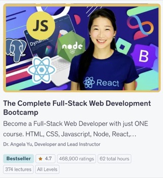

# Web Development Bootcamp Portfolio

Hi! I'm David Hu. This repo is my working archive from **Dr. Angela Yu**’s **[The Complete Full-Stack Web Development Bootcamp](https://www.udemy.com/course/the-complete-web-development-bootcamp/)** on Udemy. It’s a project-based path from HTML, CSS, JavaScript, jQuery, and React through tooling, Node/Express and databases, deployment, and introductory Web3.

*The image of the course below in case Udemy has its less-than-infrequent skill issues.*

  

This was my first entry point into computer science before formal CS or industry; when I naively thought software engineering was just “coding” (Things have really changed! lol). I wrote all of this by hand before the age of AI, now with AI it's not so impressive but I hope you'll look back fondly like I do! :)

**Contents:** [Module guide](#module-guide) · [Course map](#course-map) · [Technologies & tools](#technologies--tools)

---

## Module guide

### [`html-portfolio/`](./html-portfolio)

- Curated **HTML/CSS** gallery: **`index.html`** plus **`screenshots/`** for a fast browse.
- Not the full lesson tree—highlights such as Flexbox pricing, Mondrian, TinDog ([`Html+CSS/`](./Html+CSS) has everything).
- **Course span illustrated:** roughly **Sections 2–11** material visualized here.

### [`Html+CSS/`](./Html+CSS)

- Every **numbered lesson** + **`Capstone 1`** offline résumé.
- **Section 2–4:** HTML & multi-page pages.
- **5–8:** CSS (meme, flag, agency, responsiveness).
- **9:** Flexbox · **10:** Grid (Mondrian) · **11:** Bootstrap (TinDog).
- Capstone: [`Capstone 1`](./Html+CSS/Capstone%201).

### [`JavaScript/`](./JavaScript)

- **Root `*.js`:** language drills (**Sections 14–15**).
- **Folders:** DOM + mini-apps (**Sections 16–18**).
  - [DOM Challenge](./JavaScript/DOM%20Challenge%20Starting%20Files)
  - [Dicee](./JavaScript/Dicee+Challenge+-+Starting+Files)
  - [Drum kit](./JavaScript/Drum%20Kit%20Starting%20Files)

### [`jQuery/`](./jQuery)

- [**`index.html`**](./jQuery/index.html) + **`index.js`:** **Section 19** API scratchpad (interactive, plain on purpose).
- **[`Simon Game/`](./jQuery/Simon%20Game):** **Section 20** capstone (sequence, audio, levels).

### [`React/`](./React)

- **Section 36**—one **Vite** React app per lesson folder.
- **Keeper** capstone thread: [293](./React/293-keeper-app-part-1-challenge) → [302](./React/302-keeper-app-part-2-starting) → [319](./React/319-keeper-app-part-3-starting) → [320](./React/320-styling-the-keeper-app-starting).
- Good single-topic stops: [`306-useState-hook`](./React/306-useState-hook), [`311-react-forms`](./React/311-react-forms).

### [`Git/`](./Git)

- Loose **Git/GitHub** notes from the course.
- **Not** a full exercise tree like the other modules.

---

## Course map

The **`#`** column is the **Udemy section number** according to the course.

| Area | Topic | # | In this repo |
|------|--------|---|----------------|
| Front-end | HTML | 2–4 | [`2.1 Heading Element`](./Html+CSS/2.1%20Heading%20Element), [`3.4 Birthday Invite Project`](./Html+CSS/3.4%20Birthday%20Invite%20Project), [`4.1+Webpages`](./Html+CSS/4.1%2BWebpages), hub [`html-portfolio/`](./html-portfolio) |
| Front-end | CSS | 5–8 | [`5.1. Adding CSS`](./Html+CSS/5.1.%20Adding%20CSS), [`6.4 Motivation Meme Project`](./Html+CSS/6.4%20Motivation%20Meme%20Project), [`7.3 CSS Flag Project`](./Html+CSS/7.3%20CSS%20Flag%20Project), [`8.4 Web Design Agency Project`](./Html+CSS/8.4%20Web%20Design%20Agency%20Project) |
| Front-end | Flexbox | 9 | [`9.0 Display Flex`](./Html+CSS/9.0%20Display%20Flex), [`9.1 Flex Direction`](./Html+CSS/9.1%20Flex%20Direction), [`9.4 Flexbox Pricing Table Project`](./Html+CSS/9.4%20Flexbox%20Pricing%20Table%20Project) |
| Front-end | Grid | 10 | [`10.0 Display Grid`](./Html+CSS/10.0%20Display%20Grid), [`10.2 Grid Placement`](./Html+CSS/10.2%20Grid%20Placement), [`10.3 Mondrian Project`](./Html+CSS/10.3%20Mondrian%20Project) |
| Front-end | Bootstrap | 11 | [`11.0 Bootstrap Intro`](./Html+CSS/11.0%20Bootstrap%20Intro), [`11.2 Bootstrap Components`](./Html+CSS/11.2%20Bootstrap%20Components), [`11.3 TinDog Project`](./Html+CSS/11.3%20TinDog%20Project) |
| Front-end | HTML/CSS capstone | Capstone 1 · *Online Resume* ([`Html+CSS/README.md`](./Html+CSS/README.md)) | [`Capstone 1`](./Html+CSS/Capstone%201) |
| Front-end | JavaScript (ES6 core) | 14–15 | [`JavaScript/`](./JavaScript) · top-level `*.js` (variables → arrays/objects, control flow, small exercises) |
| Front-end | DOM & browser mini-apps | 16–18 | [`DOM Challenge Starting Files`](./JavaScript/DOM%20Challenge%20Starting%20Files) · [`Dicee+Challenge+-+Starting+Files`](./JavaScript/Dicee+Challenge+-+Starting+Files) · [`Drum Kit Starting Files`](./JavaScript/Drum%20Kit%20Starting%20Files) |
| Front-end | jQuery | 19–20 | [`jQuery/index.html`](./jQuery/index.html) (+ [`index.js`](./jQuery/index.js)) · [`Simon Game`](./jQuery/Simon%20Game) |
| Front-end | React (+ hooks / Keeper) | 36 | [`React/`](./React) · JSX entry [`280-jsx-code-challenge`](./React/280-jsx-code-challenge) · props/components e.g. [`286-react-components`](./React/286-react-components) · [`306-useState-hook`](./React/306-useState-hook) · [`311-react-forms`](./React/311-react-forms) · Keeper [`293-keeper-app-part-1-challenge`](./React/293-keeper-app-part-1-challenge) → [`302-keeper-app-part-2-starting`](./React/302-keeper-app-part-2-starting) → [`319-keeper-app-part-3-starting`](./React/319-keeper-app-part-3-starting) → [`320-styling-the-keeper-app-starting`](./React/320-styling-the-keeper-app-starting) |
| Tooling | Git, GitHub | *—* | [`Git/`](./Git) *(no index noted in those READMEs)* |
| Tooling | Bash / command line | — | — |
| Back-end | Node, Express, EJS, REST, APIs, SQL, PostgreSQL, auth | — | — |
| Design & shipping | Deployment (e.g. GitHub Pages) | — | — |

---

## Technologies & tools

**Front-end:** HTML5 · CSS3 · Flexbox · CSS Grid · Bootstrap 5 · JavaScript (ES6+) · DOM APIs · jQuery · React · React Hooks  

**Tooling:** Bash · Git · GitHub  

**Back-end & data:** Node.js · NPM · Express.js · EJS · REST · APIs · SQL · PostgreSQL · authentication  

**Design & delivery:** web design (layout, UI patterns) · deployment (e.g. GitHub Pages)  

**Web3:** Internet Computer · blockchain · token contracts · NFT minting/trading (introductory)

---

Thanks for stopping by! 🌱
