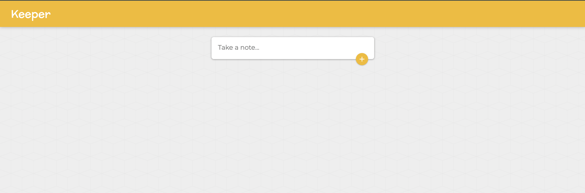
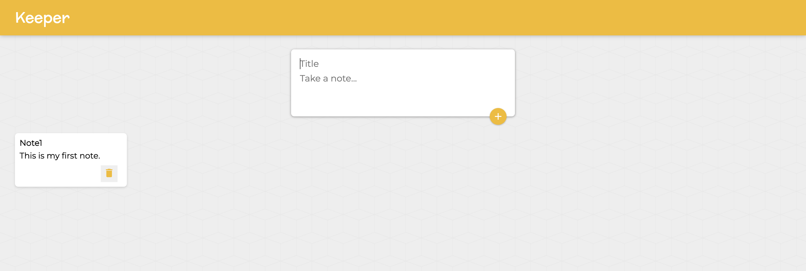
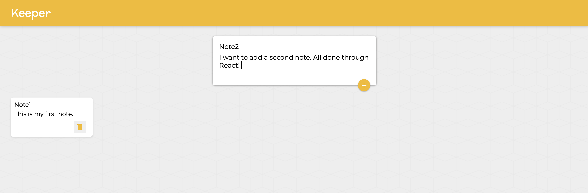
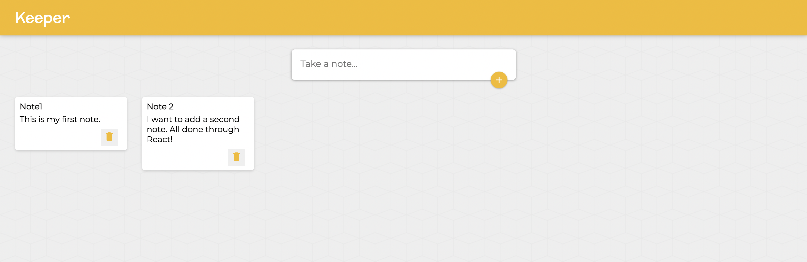

# ⚛️ React Lessons & Practice Code

Welcome! This repository contains my completed React exercises from **Dr. Angela Yu's Web Development Bootcamp**. Each folder corresponds to a lesson module and includes a working code solution to the concept taught in that video.

I've used this section to deepen my understanding of modern front-end development with **React**, practicing everything from JSX and props to component trees and state management.

---

## 🧠 Skills Practiced

- **JSX Syntax & Styling**
- **Component Architecture**
- **ES6+ JavaScript in React (arrow functions, spread operator, destructuring)**
- **React Props & State**
- **Hooks: `useState`**
- **Conditional Rendering**
- **Event Handling & Forms**
- **Managing Component Trees**
- **Intro to Functional vs Class Components**

---

## 📁 Folder Guide

| Folder Name | Concept Practiced |
|-------------|-------------------|
| `280-jsx-code-challenge` | JSX basics and syntax |
| `281-javascript-expressions-in-jsx` | Embedding JS in JSX |
| `282-javascript-expressions-in-jsx-practice` | Hands-on practice |
| `283-jsx-attributes-and-styling` | HTML attributes, inline styles |
| `284-inline-styling-in-jsx` | JS-style objects for CSS |
| `285-react-styling-practice` | Practical styling techniques |
| `286-react-components` | Creating components |
| `287-react-components-practice` | Component structuring |
| `288-es6-import-export-and-modules` | Module system in React |
| `289-es6-import-export-practice` | Practice with modular code |
| `293-keeper-app-part-1-challenge` | Start of full-featured Keeper App |
| `295-react-props` | Passing data with props |
| `296-react-props-practice` | Props deep dive |
| `297-react-devtools` | Debugging React apps |
| `298-mapping-components` | Mapping arrays to components |
| `299-mapping-components-practice` | Practical mapping |
| `300-map-filter-reduce` | ES6 array methods |
| `301-es6-arrow-functions` | Writing concise functions |
| `302-keeper-app-part-2-starting` | Adding list & delete features |
| `303-conditional-rendering` | Dynamic UIs |
| `304-conditional-rendering-practice` | Practice rendering logic |
| `305-introduction-to-state-completed` | Managing internal component state |
| `306-useState-hook` | Using `useState` effectively |
| `307-useState-hook-practice` | More `useState` scenarios |
| `308-es6-destructuring` | Cleaner variable extraction |
| `310-event-handling-in-react` | DOM event responses |
| `311-react-forms` | Handling user input |
| `312-class-components-vs-hooks` | Functional vs class comparison |
| `313-changing-complex-state` | Nested state updates |
| `314-changing-complex-state-practice` | Practice complex state |
| `315-es6-spread-operator` | Cloning and merging state |
| `316-es6-spread-operator-practice` | Spread operator in React |
| `317-managing-a-component-tree` | Passing data/functions across components |
| `318-managing-a-component-tree-practice` | Component tree patterns |
| `319-keeper-app-part-3-starting` | Building final Keeper App features |
| `320-styling-the-keeper-app-starting` | Applying custom CSS/styling to app |

> 🗂 All folders contain complete, working solutions—feel free to explore the code and run each project locally!

---

Don't know where to start? See everything combined together in one mini-project by running the last folder (320) to view my fully functional and styled Keeper App!

### 🖼️ Preview






---

## 🚀 Running the Code

1. Navigate into the folder you're interested in:

   ```bash
   cd 286-react-components
   ```

2. Install dependencies and start the server:

   ```bash
   npm install
   npm run dev
   ```

   OR (for modules not using JSX)

   ```bash
   npm build
   npm start
   ```

---

## 📌 Course Mapping

This section includes material from:

- **Section 36:** React.js

---

## 🎯 Purpose

This repository tracks my hands-on progress through the **React module** of Angela Yu’s course. It serves as both a learning log and a demonstration of my growing React.js skill set. If you're a recruiter, mentor, or peer developer—thank you for checking out my work!

---

## 🙌 Let's Connect

If you'd like to collaborate on another project or have feedback for this one, feel free to reach out via [LinkedIn](https://www.linkedin.com/in/davidhu426).
