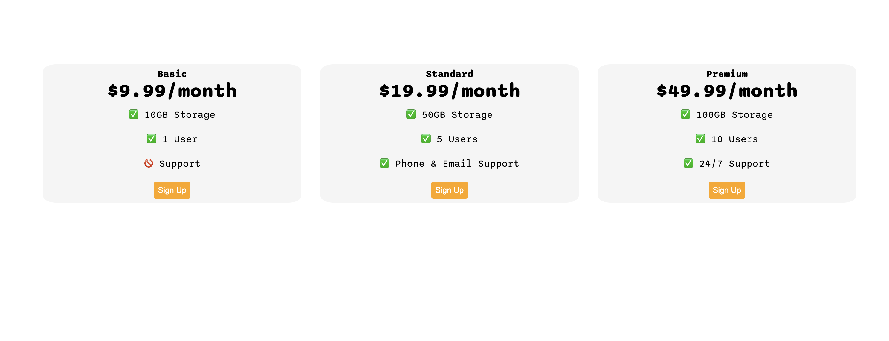
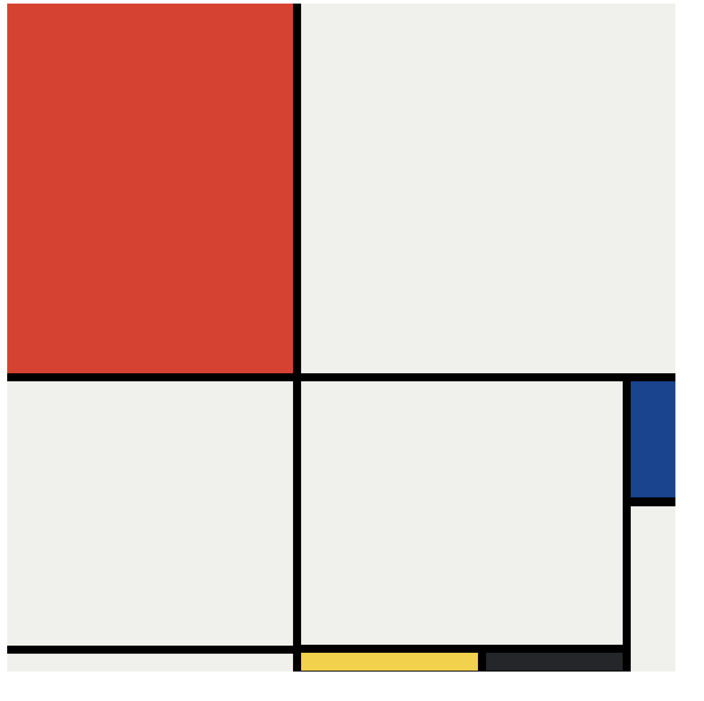
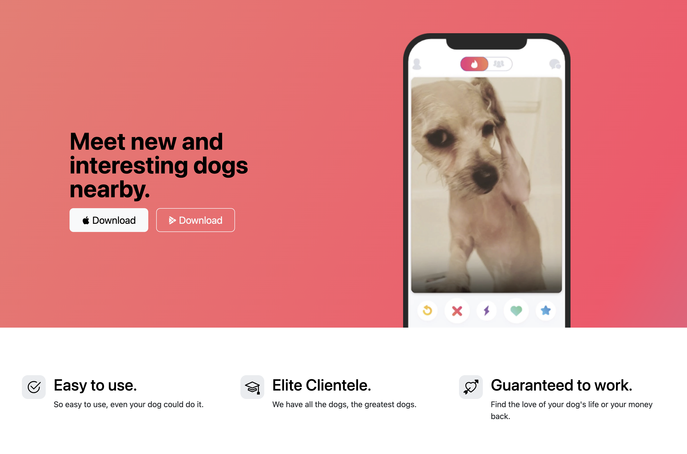
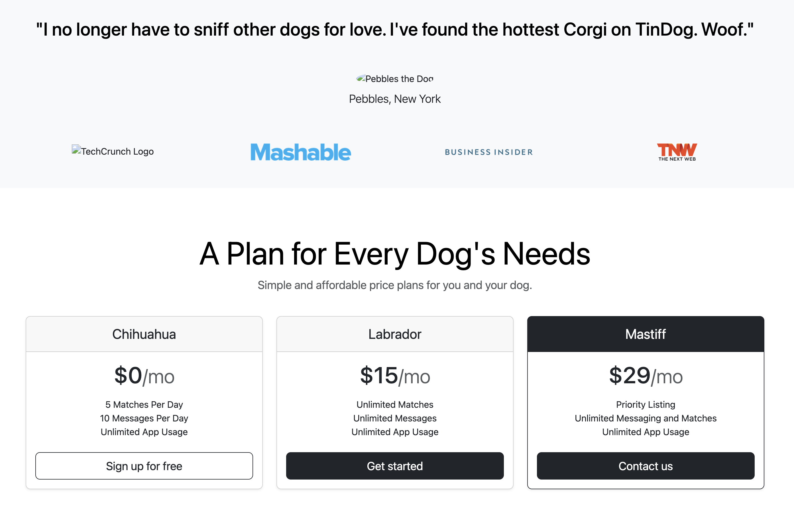
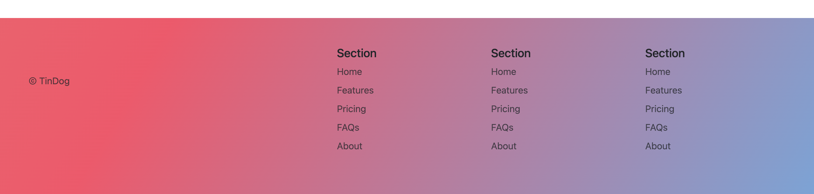

# HTML/CSS portfolio hub

[`index.html`](./index.html) is a static showcase of my favorite lesson homeworks for the HTML + CSS units of **Dr. Angela Yu’s** *[The Complete Full-Stack Web Development Bootcamp](https://www.udemy.com/course/the-complete-web-development-bootcamp/)*. Open it with your browser to see! Each card links into the original lesson folder under [`Html+CSS/`](../Html%2BCSS/) which contains ALL of the homeworks, not just the favorites I've curated for you here; this directory is for the landing page of the portfolio. For the rest of the bootcamp archive, see the [repo overview](../README.md).

**Contents:** [What this folder is](#what-this-folder-is) · [Layout](#layout) · [Projects](#projects) · [Sample previews](#sample-previews) · [Navigate this repo](#navigate-this-repo)

---

## What this folder is

- **Hub page** — [`index.html`](./index.html) + [`styles.css`](./styles.css): thumbnails and relative links to my nine favorite exercises in `Html+CSS/`.
- **Screenshots** — [`screenshots/`](./screenshots): The snapshots of what each individual project looks like. The hub collates these for the preview.
- **Reference HTML** — [`public/`](./public): instructor-style snippets for early multi-page drills (movie ranking, birthday invite, about, contact). Root-level [`about-david.html`](./about-david.html) and [`contact-david.html`](./contact-david.html) are also personal variations of her "about me" and "contact me" html page lessons. I build upon these given files to complete the assignments.
- **Lesson artifacts** — [`solution.html`](./solution.html) and [`goal.png`](./goal.png) is the instructor example of what she expects the portfolio to look like, I model off of that; [`assets/images/`](./assets/images) carries a small set of bundled reference images used in her solutions.

This tree used to live in the standalone repo [`html-portfolio`](https://github.com/dhu2022-dev/html-portfolio) (now archived); history was folded into this monorepo.

---

## Layout

```
html-portfolio/
├── assets/images/          # bundled reference screenshots (from the course)
├── public/                 # starter HTML (movie, invite, about, contact)
├── screenshots/            # thumbnails from my completed projects used on index.html
├── about-david.html
├── contact-david.html
├── goal.png
├── index.html              # LOOK HERE! The actual portfolio hub
├── solution.html           # instructor-style portfolio solution
├── styles.css
└── README.md
```

---

## Projects

Links point at the live exercise folders (spaces URL-encoded for portability).

| Project | Focus | Location |
|--------|--------|----------|
| Movie ranking | Structure, lists, headings | [`2.4 Movie Ranking Project`](../Html%2BCSS/2.4%20Movie%20Ranking%20Project/) |
| Birthday invite | Images, links, hierarchy | [`3.4 Birthday Invite Project`](../Html%2BCSS/3.4%20Birthday%20Invite%20Project/) |
| Color vocabulary | Color + typography | [`5.4 Color Vocab Project`](../Html%2BCSS/5.4%20Color%20Vocab%20Project/) |
| Motivational meme | Box model, imagery | [`6.4 Motivation Meme Project`](../Html%2BCSS/6.4%20Motivation%20Meme%20Project/) |
| CSS flag | Positioning | [`7.3 CSS Flag Project`](../Html%2BCSS/7.3%20CSS%20Flag%20Project/) |
| Web design agency | Sections, class-based layout | [`8.4 Web Design Agency Project`](../Html%2BCSS/8.4%20Web%20Design%20Agency%20Project/) |
| Flexbox pricing | Flex layout, cards | [`9.4 Flexbox Pricing Table Project`](../Html%2BCSS/9.4%20Flexbox%20Pricing%20Table%20Project/) |
| Mondrian | CSS Grid | [`10.3 Mondrian Project`](../Html%2BCSS/10.3%20Mondrian%20Project/) |
| TinDog | Bootstrap, responsive sections | [`11.3 TinDog Project`](../Html%2BCSS/11.3%20TinDog%20Project/) |

---

## Sample previews

### Flexbox pricing



### Mondrian (CSS Grid)



### TinDog (Bootstrap)







---

## Navigate this repo

**← Previous:** [HTML & CSS — full lesson tree](../Html%2BCSS/)  
**→ Next:** [JavaScript (sections 14–18)](../JavaScript/)

---
