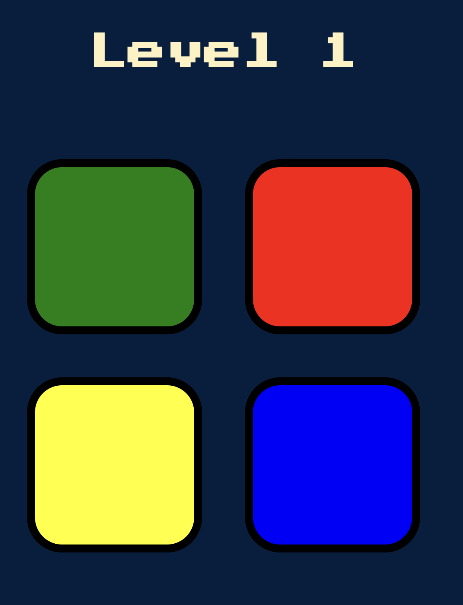

# ⚙️ jQuery Practice & Simon Game

This folder contains my jQuery practice and the capstone **Simon Game** project built during Sections 19–20 of Dr. Angela Yu’s Web Development Bootcamp.

Through these lessons, I learned how to integrate jQuery into static web projects, select and manipulate DOM elements, animate components, and handle events — culminating in the fully interactive Simon Game.

---

## 🧠 Skills Practiced

- jQuery syntax and CDN usage
- DOM element selection with jQuery
- Text, style, and attribute manipulation
- Event listeners (`.click()`, `.keypress()`)
- Adding/removing elements dynamically
- Website animations with `.fadeIn()`, `.fadeOut()`, `.animate()`
- Game logic sequencing with arrays and user input

---

For the initial learning index.html (not the Simon one) it's supposed to not look very aesthetic. But play around with the buttons and textbox and see what happens! That's the fun part and where my jquery learning is applied.

---

## 🧩 Project Highlight: The Simon Game

### 🎮 Description

A memory game inspired by the classic Simon electronic game. A random pattern of button colors is played, and the user must repeat the sequence by clicking the buttons in order. Open it by opening the index.html (under the Simon Game folder!) in your browser.

### 🔢 How to Play

1. Press any key to begin the game.
2. Watch the sequence of colors and sounds played by the computer.
3. Repeat the sequence by clicking the corresponding colored buttons.
4. The sequence gets longer each round. One mistake = game over!
5. Press any key again to restart.

### 🖼️ Preview



---

## 📁 File Structure

```
jQuery/
└── Simon Game/
    ├── sounds/             # Game audio files
    │   ├── blue.mp3
    │   ├── green.mp3
    │   ├── red.mp3
    │   ├── yellow.mp3
    │   └── wrong.mp3
    ├── game.js             # Core logic
    ├── index.html          # Game HTML
    ├── styles.css          # Styling
```

---

## 📌 Course Mapping

This section includes material from:

- **Section 19:** Intro to jQuery (selectors, events, animation)
- **Section 20:** Boss Level 2 — The Simon Game Project

---

## 🚀 Running the Game

1. Open `index.html` in your browser.
2. Open the browser console to view any game logs.
3. Play using your keyboard and mouse.

---

## 🎯 Purpose

This section demonstrates my ability to apply jQuery in a real-world game setting, showcasing not just interactivity, but logic design, sequence memory, and dynamic feedback.

---

## 🙌 Let’s Connect

Feel free to reach out or collaborate on interactive front-end projects. You can find me on GitHub or [LinkedIn](https://www.linkedin.com/davidhu426).
